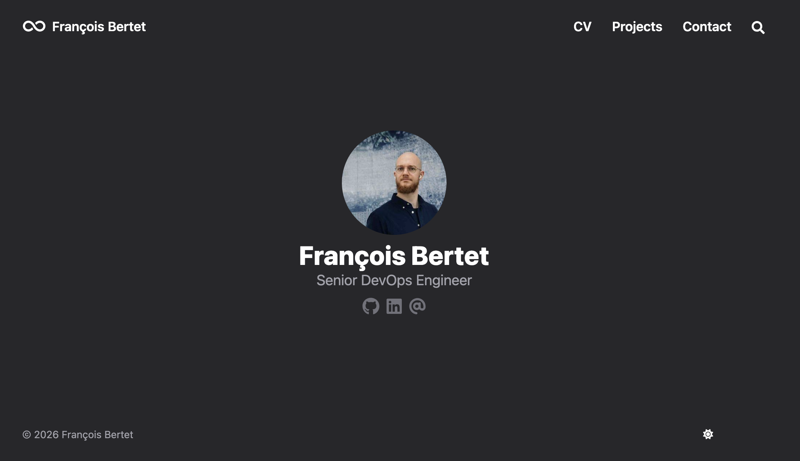

# francois.bertet.dev

[](https://github.com/fbertet/francois.bertet.dev/deployments/github-pages)
[](https://stats.uptimerobot.com/eniLI7gU6f)
[](https://stats.uptimerobot.com/eniLI7gU6f)
[](LICENSE)

<p align="center">
  
</p>

My [**personal website**](https://francois.bertet.dev) built with [Hugo](https://gohugo.io/) framework and [Congo](https://github.com/jpanther/congo) theme.


## Local Development

To preview changes locally before deploying:

```bash
https://github.com/fbertet/francois.bertet.dev && cd francois.bertet.dev
hugo serve
```

Then visit `localhost:1313` in your browser. The site will automatically reload when you make changes to the source files.

NB: In case of problems, please make sure you use Hugo version `0.111.3`.

## Deployment

This static website is hosted on Github pages.

Changes are automatically deployed via [Github Actions](https://github.com/fbertet/francois.bertet.dev/deployments/github-pages) whenever changes are pushed to the main branch.

The custom domain `francois.bertet.dev` is configured through a CNAME DNS record pointing to GitHub Pages.


## License

This project is licensed under the Creative Commons Attribution-ShareAlike 4.0 International License (CC-BY-SA-4.0) – see the [LICENSE](LICENSE) file for details.
