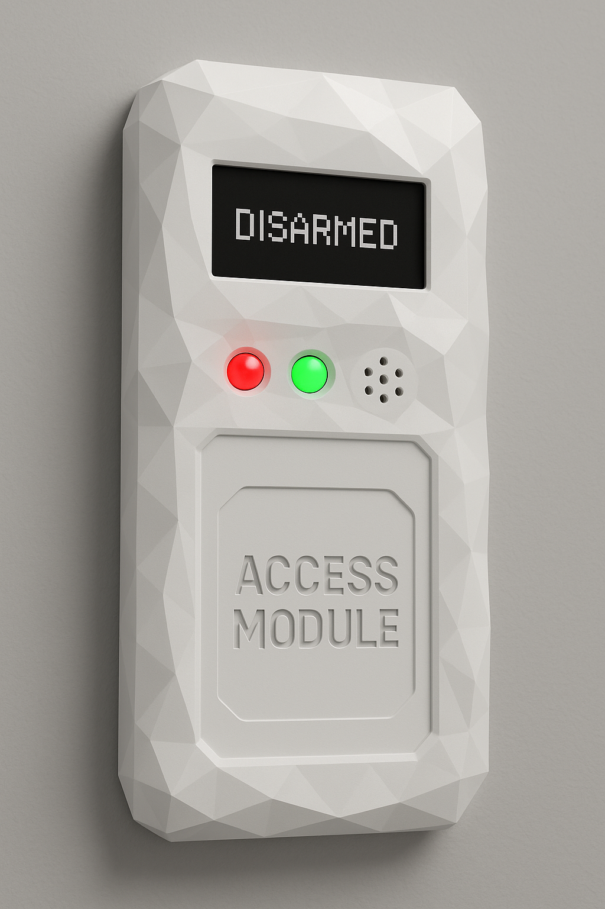
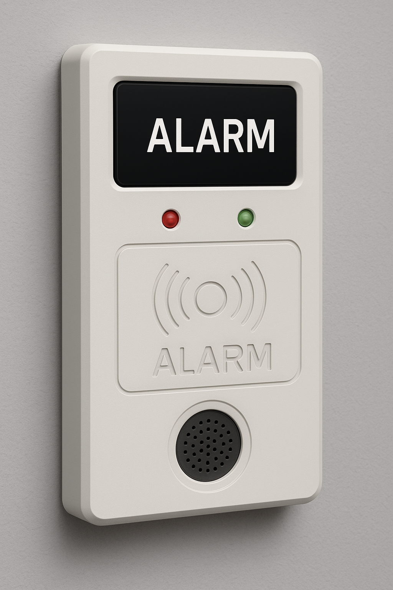
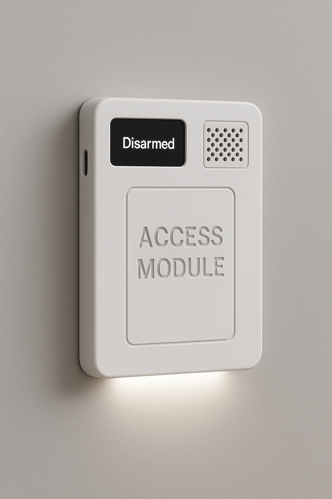
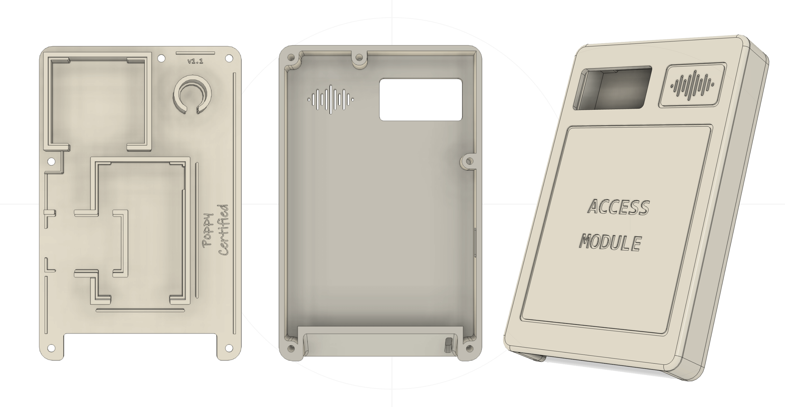
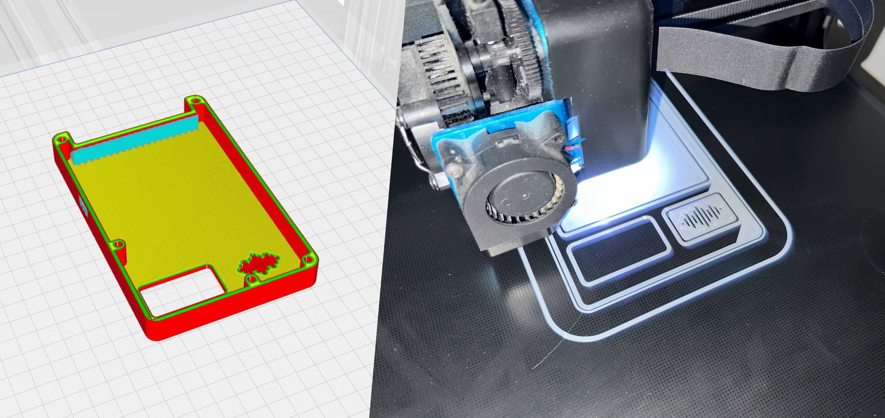
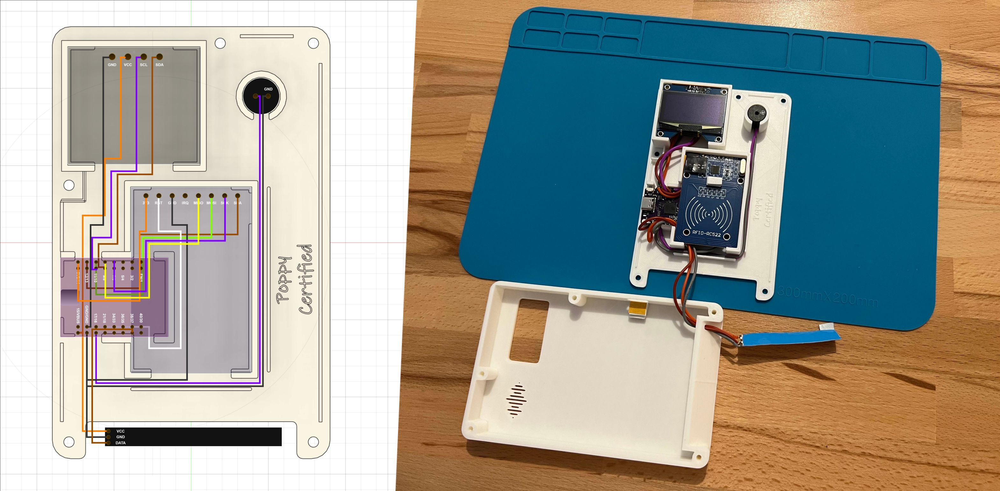
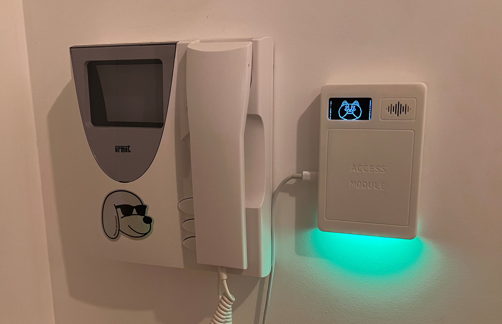


A 3D printed custom alarm panel based on ESPHome to be used with Home Assistant.



## Project Genesis

After setting up an advanced home alarm system using Home Assistant, I started looking for an alarm panel on the market but couldn't find one that suited my needs. That's why I came up with the idea of designing one from scratch using 3D printing and ESPHome for the software part.

NB: Although the final result differs a lot (In terms of usage, software and hardware), this project was inspired by this [YouTube video](https://youtu.be/qzofMR-WtJw?si=PYulEtwfABFObON4&t=1020).


## Target 🎯

Since the possibilities are quite vast (not to say infinite), the first step was to clearly define the requirements:
1. Allow the alarm to be activated/deactivated while authenticating the user's identity,
2. Provide clear visual and audible feedbacks during these actions,
3. Display a countdown when the alarm is being activated.


It's known there are several authentication methods:
- “Something you know”: password/code
- “Something you have”: RFID badge
- “Something you are”: Fingerprint/facial recognition

The best option is to combine several of these. As our apartment is not Fort Knox, we decided that the best option was an RFID badge attached to the apartment keys so that we could easily grant access to a third party. In terms of feedback, we opted for a small buzzer, a LED strip, and a display to show the alarm activation countdown and, as a bonus, fun little animations and the time.


## Components 🤖

The next step was to identify and purchase all the required components.

To control everything, the idea was to use an ESP32 running ESPHome.
ESP are energy-efficient microcontrollers that integrate both Wi-Fi and Bluetooth capabilities. Since this project doesn't need a lot of power and RAM, I opted for an ESP32 S2 Mini.

Here is the list I ended up with (All compatible with [ESPHome](https://esphome.io/components/)):
* ESP32 S2 Mini ([Link](https://fr.aliexpress.com/item/1005006246777213.html))
* CH1116 1.54" OLED Screen ([Link](https://fr.aliexpress.com/item/1005009132302307.html))
* MFRC-522 RFID Reader ([Link](https://fr.aliexpress.com/item/1005007038131464.html))
* Active 5V Buzzer 12x9.5mm ([Link](https://fr.aliexpress.com/item/1005007143315059.html))
* WS2812B 144LED/m led-strip ([Link](https://fr.aliexpress.com/item/1005007982624217.html))
* 24 AWG wires ([Link](https://fr.aliexpress.com/item/1005007391168450.html))
* 5 M3 8mm torx screws ([Link](https://fr.aliexpress.com/item/4000222500869.html))
* ELEGOO Matte White PLA ([Link](https://www.amazon.fr/ELEGOO-Imprimante-Pr%C3%A9cision-Dimensionnelle-Imprimantes/dp/B0D4Z8QT5T))

Once the components had been ordered, it was time to think about the 3D printed alarm panel case that would house them.


## Design, 3D Modelling and printing

In terms of aesthetic, I wanted something simple and modern. In order to get some inspiration, I pitched my ideas to ChatGPT, making sure to list the hardware requirements so that it could generate some renderings:

<div style="display: flex; width: 100%; gap: 10px;">
  
  
  
</div>

Apart from the rather old-fashioned grid design, I quite liked the third design (on the right) proposed by ChatGPT so it was time to open Autodesk Fusion360 and start modelling the case.



It is composed of two parts:
- The backplate where all components will be placed and held. It also includes some passages narrow canals to guide the cables.
- The faceplate that covers everything. As you can see, the buzzer grid has been redesigned to look like the Spotify logo which I find stylish.

The two parts are assembled together using 5 M3 8mm torx screws.




## Wiring & Soldering

In order to optimize the space inside the case, the wiring was designed in parallel with the 3D modeling.



| CH1116 OLED Screen  | ESP32 S2 Mini | Detail          |
|---------------------|---------------|-----------------|
| SDA                 | GPIO 8        | I2C Data        |
| SCL                 | GPIO 10       | I2C Clock       |
| GND                 | GND           | Ground          |
| VCC                 | 5V            | 5V Alimentation |

| MFRC522 RFID Reader    | ESP32 S2 Mini | Detail               |
|------------------------|---------------|----------------------|
| SDA                    | GPIO 12       | SPI Chip select. pin |
| SCK                    | GPIO 7        | Clock                |
| MOSI                   | GPIO 11       | Data to MFRC522      |
| MISO                   | GPIO 9        | Data from MFRC522    |
| RST                    | GPIO 21       | Reset                |
| GND                    | GND           | Ground               |
| 3V3                    | 3V3           | 3.3V Alimentation    |

| Active 5V Buzzer | ESP32 S2 Mini | Detail            |
|------------------|---------------|-------------------|
| GND              | GND           | Ground            |
| VCC              | GPIO 16       | 5V Buzzer control |

| WS2812B Ledstrip | ESP32 S2 Mini | Detail          |
|------------------|---------------|-----------------|
| DATA             | GPIO 37       | Data control    |
| VCC              | VBUS          | 5V Alimentation |
| GND              | GND           | Ground          |

Once all cables were soldered, it wasn't easy to make everything fit inside the case but in the end it worked as planned!

Before screwing everything down, I added an extra layer of opaque stickers inside the case to avoid any light bleeding. A more elegant solution to this problem would have been to print a thin layer of black filament inside the case but it requires a 3D printer that is able to print a single piece with multiple colored filaments.


## The software part: ESPHome


ESPHome is an open-source system that lets you control and monitor microcontrollers like ESP8266 and ESP32 using simple yaml configuration files. It allows these devices to interact with sensors, switches, displays, and other components, while integrating easily with platforms like Home Assistant.

No code has been written for this project, only a long yaml configuration file. Here is a fragment of it, the part that manages the 5V buzzer:
``` yaml
# Configuration that specifies on which GPIO pin the buzzer is plugged.
switch:
  - platform: gpio
    pin: GPIO16
    name: "Buzzer Switch"
    icon: "mdi:volume-high"
    id: buzzer

[...]

# Scripts that are called when a rfid tag is scanned:
# Two shorts bip for a valid tag / A long bip for a wrong tag.
script:
  - id: valid_tag_feedback
    then:
      - [...]
      - switch.turn_on: buzzer
      - delay: 100ms
      - switch.turn_off: buzzer
      - delay: 100ms
      - switch.turn_on: buzzer
      - delay: 100ms
      - switch.turn_off: buzzer
      - [...]

  - id: wrong_tag_feedback
    then:
      - [...]
      - switch.turn_on: buzzer
      - delay: 600ms
      - switch.turn_off: buzzer
      - [...]

[...]
```

Overall, the YAML configuration file describes four alarm panel modes:

| Mode        | Alarm state                | Display state               | Ledstrip state | Buzzer state
|-------------|----------------------------|-----------------------------|----------------|---------------
| **Standby** | Disabled                   | Time of the day             | Turned off     | Turned off
| **Arming**  | Will be armed in 30sec     | 30sec countdown             | Orange         | Turned off
| **Waiting** | Will be triggered in 30sec | Waiting character animation | Orange         | Turned off
| **Alert**   | Triggered, intrusion!      | Angry character animation   | Blinking red   | ON every sec

Multiple Home assistant automations have been setup to set the alarm panel mode correctly depending on the current alarm state.

It also describes what to do in case a tag is presented in front of the RFID reader. Its value is read, checked and a feedback is given accordingly:
| Tag       | Display state             | Ledstrip state | Buzzer state
|-----------|---------------------------|----------------|----------------
| **Valid** | Happy character animation | Green          | Two short bips
| **Wrong** | Sad character animation   | Red            | One long bip

In addition to this feedback, an event is sent to Home Assistant that acts in consequence to activate/deactivate the alarm.

<div style="display: flex; width: 100%; gap: 10px;">
  
  
  
</div>
<figcaption class="text-center">Funny little animations: Waiting - Valid tag - Wrong tag</figcaption>
<br />


These animations are featuring a cute corgi stuffed animal we have at home 💚



## Final result ✨

Here is the final result we use everyday:


In addition to activating / deactivating the alarm, a set of Home Assistant automations turn off the whole home when we're leaving / restore the home state when we're back, making our lives easier :-)

Special thanks to Valeria that helped me on that project! 😉

As usual, all the parts of this project can be found on my Github: [FIXME]
