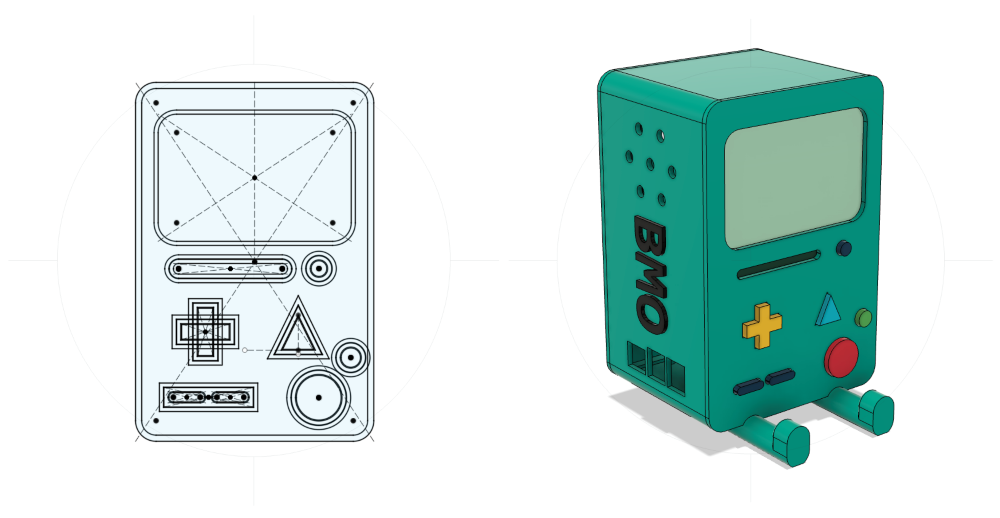
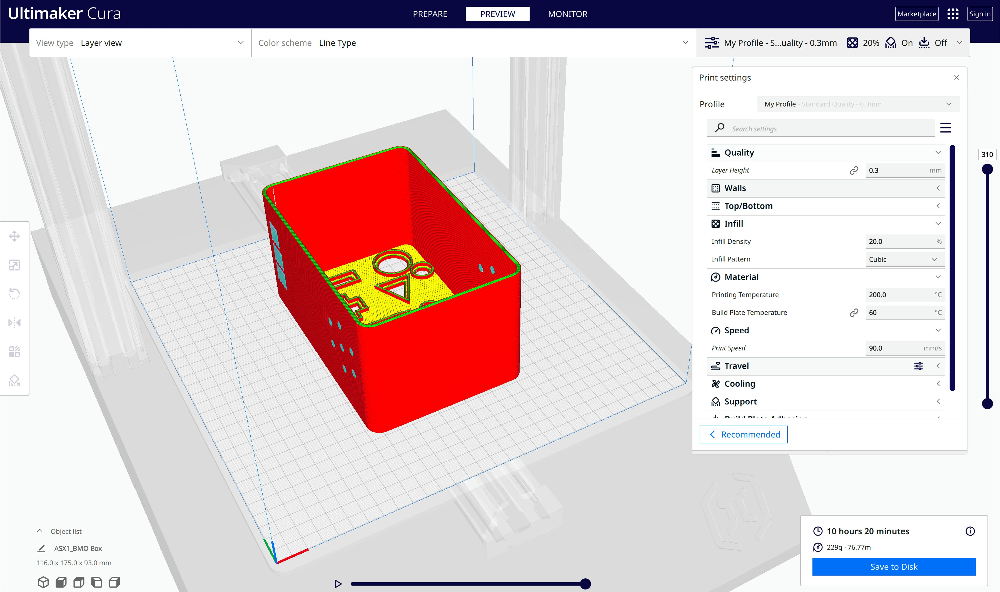
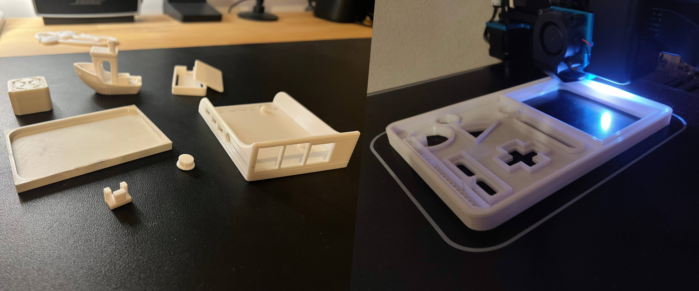
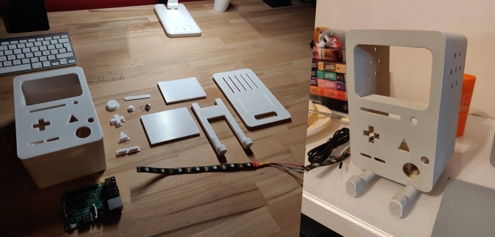
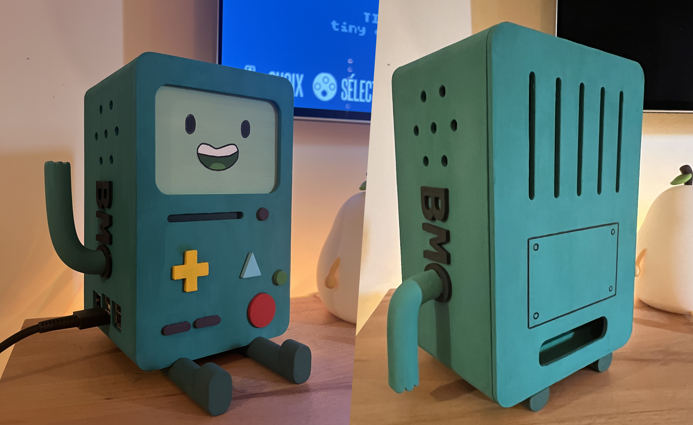


A 3D Printed BMO Enclosure for a Retro gaming console emulator.



## Project Genesis

BMO is one of the main characters of Adventure Time, a *"living prototype video game console system"*, according to https://adventuretime.fandom.com

This project was my first big 3D modeling & printing project. It consists of a 3D printed BMO enclosure for a Raspberry Pi 3 running [Recalbox](https://www.recalbox.com).

It was motivated by three reasons:
- My Raspberry Pi 3 was missing an enclosure,
- I needed a project to learn how to use Fusion360,
- BMO is a cute character 💚


## Recalbox

Recalbox is an open-source operating system that turns a small computer like a Raspberry Pi into a retro gaming console with an easy-to-use interface and built-in emulators. Running it was the easiest part of the project.


## Modeling



The modeling was done using [Autodesk Fusion360](https://www.autodesk.com/fr/products/fusion-360/overview) which I learned to use on my own with the help of online tutorials & YouTube videos. This learning phase can be tedious, but mastering CAD software is essential to get the most out of 3D printing. It has enabled me to complete many projects since then.

There are best practices to follow when using Fusion360. One of them is to place everything using constraints. The concept is exactly the same as for a web or mobile interface: in case dimensions are modified, everything around adapts instantly.

Another thing to keep in mind is the constraints of 3D printing in order to optimize the model. For example, in this case, the back of the BMO was designed like a box lid, printed separately to minimize the need for supports (material waste).

Once done, it was time to export each part individually as generic *.stl* files for printing! Or not… In fact, *.stl* files are not readable by 3D printers. They need to be converted to [G-Code instructions](https://en.wikipedia.org/wiki/G-code) using a slicer software like [Ultimaker Cura](https://ultimaker.com/software/ultimaker-cura/).


## Slicing


G-code instructions are basically Assembly instructions but for CNC & 3D printers, a few examples:
```
M140 S60 ; Set the bed temperature at 60°C
G1 X10 Y20 Z0.3 F1500 ; Move printer head to pos (X=10, Y=20, Z=0.3) at 1500 mm/min speed
G1 E5 F300 ; Extrude 5mm of filament at 300mm/min speed
[...]
```



A slicer software like Cura allows to customize lots of parameters regarding the print itself like the 3D printer nozzle temperature, motors speed, layers thickness, infill pattern... and also add supports when the model has an overhang or a bridge that is not supported by anything below. All of this results in *.gcode* files.

Once I had the *.gcode* files, everything was finally ready to bring BMO to the real world!


## Prototyping & 3D printing



As a reminder, beyond being a decoration, this BMO had to work as an enclosure for a Raspberry Pi 3, so I included fixings & holes for the Raspberry Pi 3 connectors.

To avoid waste of material, it seemed important to make sure that these parts were compatible with the Raspberry Pi form factor before printing the entire model. This is why I printed small individual parts for prototyping (Left picture).

After minor adjustments it was time to print the final pieces (Right picture). More than 10 hours of printing time for the biggest BMO piece!


## Sanding & surfaces preparation



This project has been made of PLA plastic, one of the easiest materials to print with.

Other materials that are more resistant to mechanical stress exist, such as PETG or ABS. The disadvantage is that they are more complicated to print with and they release toxic particles. For this project, the properties of PLA were more than enough.

As shown above, everything was printed in white so some paint was needed to make our BMO alive! But not yet... As the Sidewinder X1 is an FDM (fused deposition modeling) 3D printer, the printed parts were not smooth enough to directly apply paint on them.

To mitigate this, the trick is to sand the surfaces thoroughly and then use automotive filler and spray primer (See [Polyworkshop video](https://www.youtube.com/watch?v=f-p6NR-_pfg)).

It took some time but the result was worth it (Right picture) :-)


## Paint & Final result

Some hours of painting and a few millilitres of glue later and voila!



The remaining step is to enjoy old video games while BMO is smiling at us 😄


All the parts of this project can be found on my Github: [FIXME]


## Conclusion

This project was my first real dive into 3D modeling and printing, and it taught me a lot — from CAD constraints to slicing tricks, prototyping, and finishing.

What started as a cute idea to give my Raspberry Pi a home quickly turned into a full-fledged learning experience that I still benefit from in later projects.
