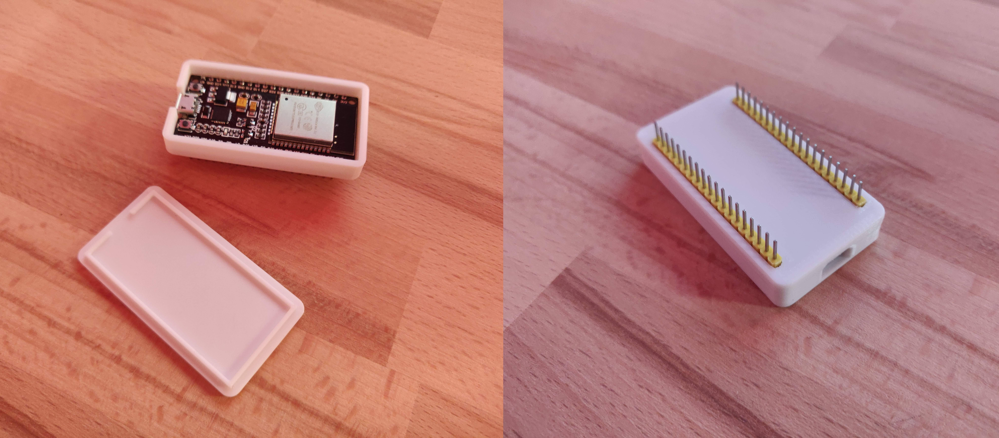
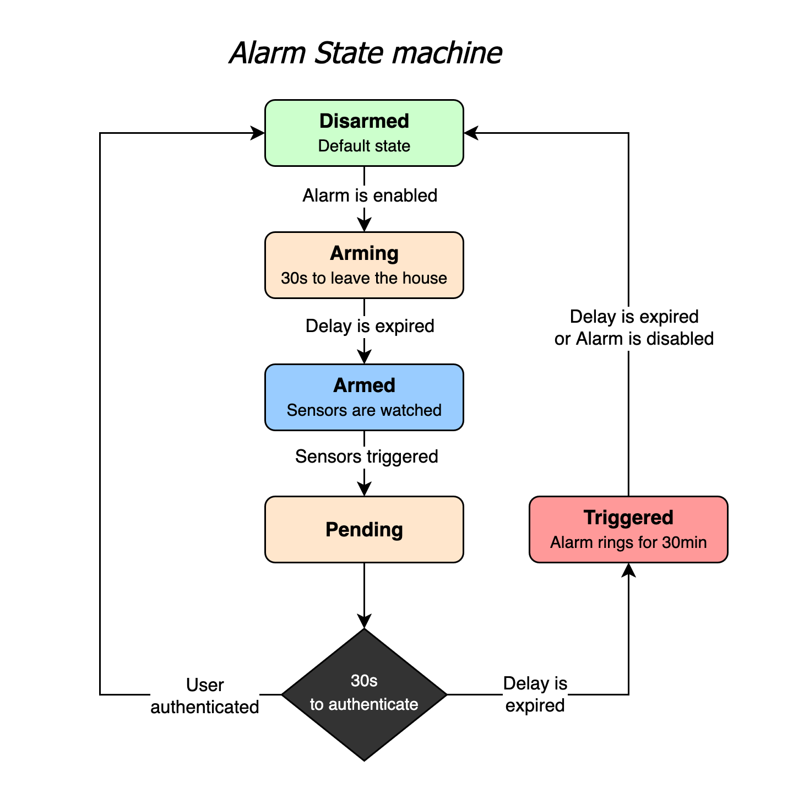
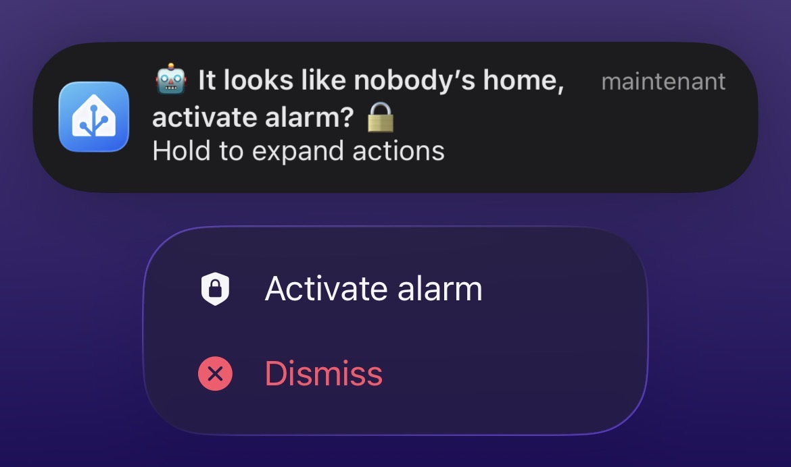
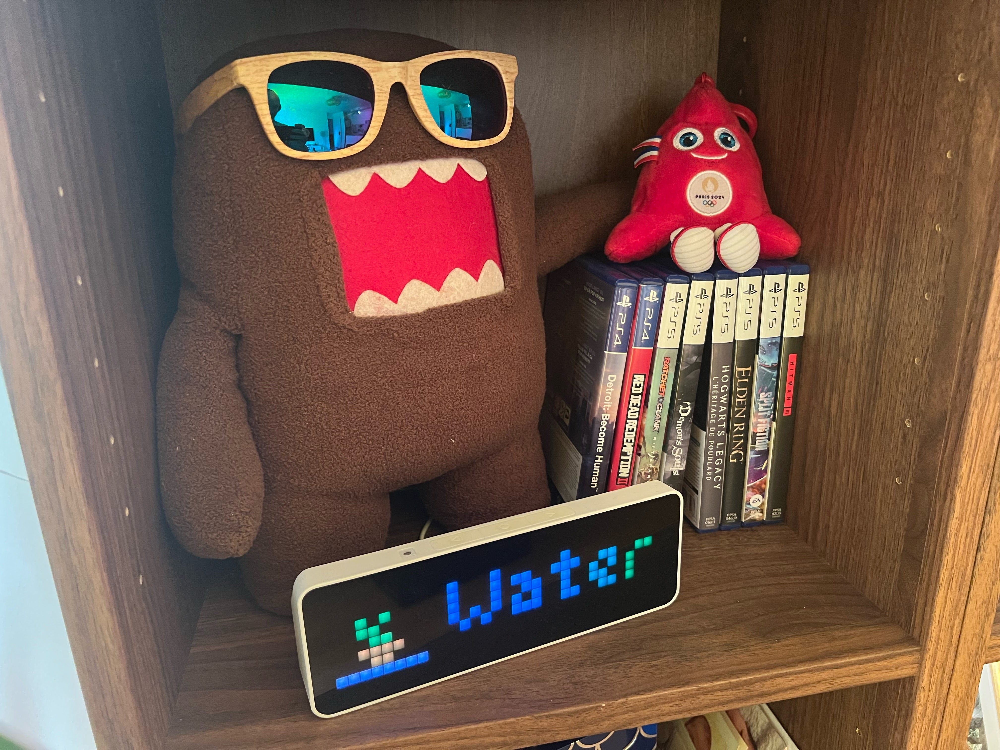


Advanced home automation using Home Assistant, an open source solution without Cloud dependencies.


## Project Genesis

In my opinion, the biggest flaws of IOT (Internet Of Things) are currently:

- **Fragmentation**: Each vendor on the market tends to create its own locked ecosystem.
Because staying locked in a particular ecosystem is too expensive / brings too much limitations, most people have to **juggle multiple mobile applications** to control their devices and **can't create complex scenarios** involving devices from different vendors.

- **Cloud dependency**: Most devices/services rely on backend services to work which brings **privacy** concerns and decreases **responsiveness**. In the worst case scenario, everything can stop working overnight in case online services are **discontinued**. Recent example: [Insteon](https://www.wired.com/story/insteon-shutdown/).

To solve these problems, I started looking at open source local Home automation solutions.

## Devices and services overview

In terms of devices/services my goal was to control products from various vendors: Philips Hue light bulbs, Spotify streaming music service, LG TV, Sonos speakers, Netatmo weather station, IKEA smart plugs, Xiaomi Aqara sensors, ... But also custom-made connected devices made with **ESP32 micro-controllers**.

For example, with the assistance of [ESPHome](https://esphome.io/), this ESP32 allows me to drive an addressable LED Strip.

## Infrastructure

Local solution means local server.

To start I chose to use a simple Raspberry Pi 3 (Since replaced by a Raspberry Pi 4) because it's cheap, energy efficient and powerful enough to run most of solutions.

In addition to its default capabilities, this Raspberry Pi is able to communicate with Zigbee devices like Xiaomi Aqara sensors thanks to a [Phoscon ConBee 2 Zigbee USB gateway](https://phoscon.de/en/conbee2).

Because a Wi-Fi Access point is nearby this Raspberry Pi, I had to plug the dongle into the end of a 2-meter USB extension cable. In fact, the Zigbee frequency range being 2.4Ghz like Wi-Fi, I experienced a lot of instabilities because of interferences.


**EDIT (2025-01-04):** With the benefit of hinsight, the main weakness of this setup is the micro-SD card which has a limited number of read/write cycles.

Its lifetime can be extended by disabling swap and logs among others but after a misadventure, I replaced it by a USB-connected SSD. Fortunately, no data loss thanks to a good backup strategy! ✨


## Software stack

After having compared different Home automation platforms, I opted for Home Assistant.

Home Assistant is an open source home automation software that puts local control and privacy first.
It's probably the most complete platform thanks to its very active community that develops and supports [integrations with over a thousand devices and services](https://www.home-assistant.io/integrations/#all).

The icing on the cake: Most of its configuration can be done through yaml files which allows to push everything in a git repository 😍.

It of course allows to create a fully customized dashboard:

")

That's nice to have but in my opinion the most important thing in Home automation is automations so your living space automatically reacts to your actions/time of day/etc without requiring anything manual.

Here are some of mine:
* Living room lights turn on progressively one hour before nightfall.
* Entrance light turns on for 45 seconds when the entrance door is opened.
* Based on motion, the toilet light is turned on at 100% brightness during the day / 25% at night.
* An animation is played on a LED strip in case the air quality is poor in the apartment.
* Sonos speakers night mode is enabled at midnight / disabled in the morning.
* A notification is sent to people that are at home when the washing machine is done so we don't forget to hang up the laundry.
* A Zigbee button allows to ring our phones to find them at home.
* Alerts are sent and all lights turn red if water or smoke is detected.
* ...

Other examples of advanced ways in which I used Home Assistant are detailed below:
* A custom alarm system
* A led matrix that displays useful information in the living room.

### Custom alarm system

My custom alarm system is based on:
* Zigbee door opening and motion sensors,
* A camera plugged into a smart plug,
* Connected lights and speakers,
* A Zigbee smoke detector (capable of emitting a loud sound on demand),
* A [homemade alarm panel](/projects/alarm) to activate/deactivate the alarm in an authenticated way.

The software part relies on [Manual Alarm control panel](https://www.home-assistant.io/integrations/manual/) integration that comes with a pre-etablished state machine:

Then, multiple custom made automations make the devices react to the changes:
* **Disarmed** → **Arming**: States and attributes of all lights are saved, ...
* **Arming** → **Armed**: Lights are turned off, "Alarm activated" notification is sent, Camera is turned on, ...
* **Pending** → **Disarmed**: "Welcome" message is played on Sonos speakers, lights state and attributes are restored, ...
* **Pending** → **Triggered**: Smoke sensor alarm rings, all lights blink in red, ...

Alarm can be armed/disarmed using the alarm panel. It can also be armed remotely via an actionable notification sent in case everybody left home without arming it:

### Ulanzi TC001 Led Matrix

The Ulanzi TC001 LED matrix is a 256-pixel display that embeds an ESP32 microcontroller. Its default firmware can easily be replaced by [Awtrix 3 custom firmware](https://github.com/Blueforcer/awtrix3)  that provides lots of features via a MQTT (or HTTP) [API](https://blueforcer.github.io/awtrix3/#/api).

I chose to use MQTT because it provides more features like broadcasting data about button presses. A prerequisite was to setup [Mosquitto](https://mosquitto.org/), an open source MQTT Broker.

Once done, I was able to write scripts on Home Assistant that send MQTT messages to this broker to create / delete information on the led matrix. These scripts are then used in various automations to display:
* Today's birthdays
* The hour of the day in which it will rain today (if it rains)
* A reminder to water the plants if necessary
* A progress bar if washing machine is running
* A reminder to hang up the laundry when the washing machine has finished
* ...

All this information is then automatically removed based on various sensors:
* Birthday reminders → The following day.
* Reminder to water the plants → When the plant sensor detects a spike in humidity.
* Reminder to hang up the laundry → When the washing machine door is opened.
* ...

We haven't missed a birthday since :-)
