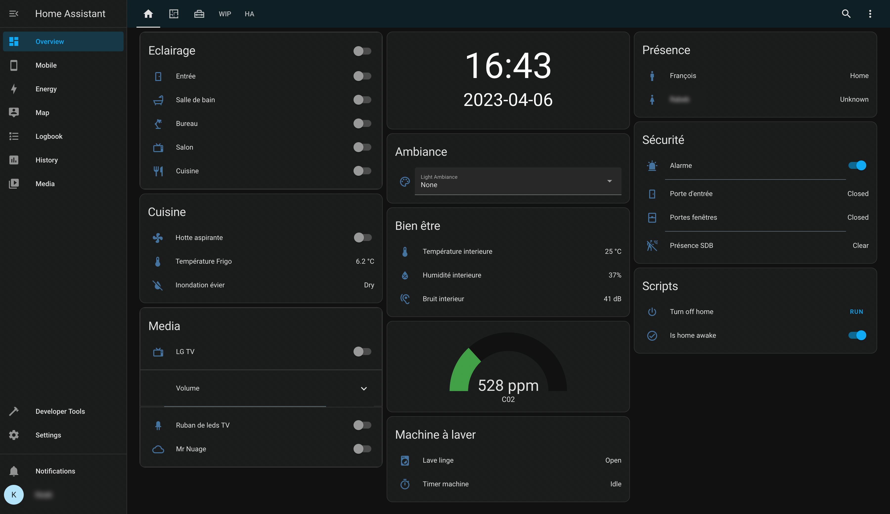


Home automation using Home Assistant, an open source solution without Cloud dependencies.


## Project Genesis

In my opinion, the biggest flaws of the IOT (Internet Of Things) are currently:

- **Fragmentation**: Each vendor on the market tends to create its own locked ecosystem.
Because staying locked in a particular ecosystem is too expensive / brings too much limitations, most people have to **juggle multiple mobile applications** to control their devices and **can't create complex scenarios** involving devices from different vendors.

- **Cloud dependency**: Most devices/services rely on backend services to work which brings **privacy** concerns and decreases **responsiveness**. In the worst case scenario, everything can stop working overnight in case online services are **discontinued**. Recent example: [Insteon](https://www.wired.com/story/insteon-shutdown/).

To solve these problems, I started looking at open source local Home automation solutions.

## Devices and services overview

In term of devices/services my goal was to control products from various vendors: Philips Hue lights, Spotify streaming music service, Netatmo weather station & camera, Tuya plugs, Xiaomi Aqara sensors, ... But also custom-made connected devices using **ESP32 micro-controllers**.

With the assistance of [ESPHome](https://esphome.io/), this ESP32 let me to drive an addressable LED Strip.

## Infrastructure

Local solution means local server.

To start I chose to use a simple Raspberry Pi 3 because it's cheap, energy efficient and powerful enough to run most of solutions.

In addition to its default capabilities, this Raspberry Pi is able to communicate with Zigbee devices like Xiaomi Aqara sensors thanks a [RaspBee](https://phoscon.de/en/raspbee) Zigbee gateway plugged on its GPIO pins.


**EDIT (2023-04-04):** With the benefit of hinsight, the main weakness of this setup is the micro-SD card which has a limited number of read/write cycles. If I had to do it again, I would use a USB-connected SSD as storage medium.

This setup has now been replaced by my custom [Homelab project](/projects/homelab).


## Software stack

After having compared different Home automations platforms, I opted for Home Assistant.

Following softwares are running in Docker containers using *docker-compose*:
* [Home Assistant](https://www.home-assistant.io): Open source local Home automation platform (See more below).
* [Deconz](https://github.com/deconz-community/deconz-docker): Software allowing ZigBee devices control using a RaspBee/Conbee.
* [PiHole](https://pi-hole.net): Ad-blocking DNS server + DHCP server.

### Home Assistant

Home Assistant is an open source home automation software that puts local control and privacy first.
It's probably the most complete platform thanks its very active community that developed and supports [integrations with over a thousand of devices and services](https://www.home-assistant.io/integrations/#all).

Icing on the cake: Most of its configuration can be done through yaml files which allows to push everything in a git repository 😍.

It of course allows to create a fully customized dashboard:

But in my opinion the most important thing in Home automation is without any doubt automations so your living space automatically reacts to your actions/time of day/etc without requiring anything manual.

Here are some of mine:
* Living room lights turn on progressively one hour before nightfall.
* Living room lights go from 100% to 5% brightness between 8pm and midnight.
* Entrance light turns on for 45 seconds when the entrance door is opened.
* Bathroom lights turns on at 100% brightness during the day / 25% at night if somebody comes.
* An animation is played on a LED strip in the living room in case the air quality is poor in the apartment.
* A loading animation is played on a LED strip when a washing machine is started. It blinks once the machine is finished so you don't forget to hang the laundry.
* Cameras turn on automatically when the alarm is activated.
* In alarm mode, all Google Home ring + lights are set in red color + an alert is sent in case the front door is open (Cheap alarm system).

I'm always fond of new automation ideas, see more in my Home assistant configuration dedicated [github repository](https://github.com/fbertet/Home-Assistant) .

### Deconz

Deconz is a software that provides a web interface to pair Zigbee devices to a Raspbee Zigbee gateway, and a RESTful API to control them once paired. Then thanks [this integration](https://www.home-assistant.io/integrations/deconz/), it is compatible with Home Assistant.

The Raspbee + Deconz combo allowed me to take advantage of cheap and reliable Zigbee sensors from different brands (Ikea Tradfri, Xiaomi Aqara, ...) without multiplying the gateways and associated mobile applications.

### Pi-hole

Having a local server running at home was also a good opportunity to set up Pi-hole, an Ad-blocking DNS server.

This solution brings several advantages compared to an ad-blocking browser plugin:
* It improves network performances since advertisements are blocked before they are downloaded
* It blocks ads in non-traditional places such as mobile apps and smart TVs
* It allows to monitor statistics via a web interface

Pi-hole also acts as a DHCP server to assign fixed IP addresses which is really important for some integrations to work properly.
