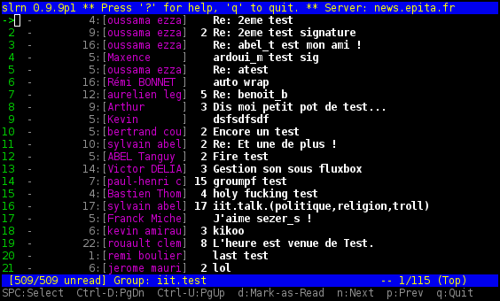
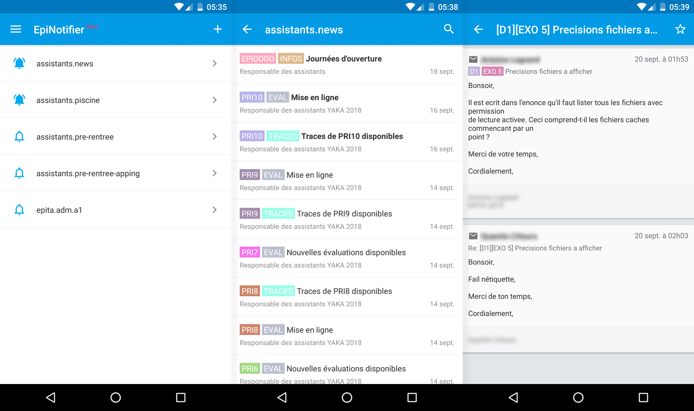
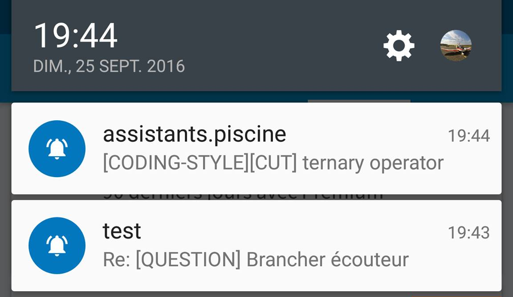
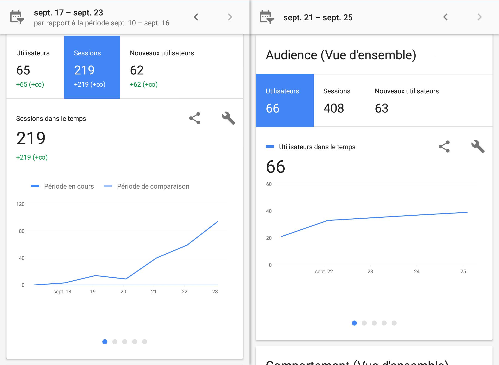


An Android app to consult and get notified about EPITA newsgroups.


## Project Genesis

During the first year of EPITA engineering cycle, EPITA students are mentored and assisted by final-year students to realize one C/C++/Java/... project per week.

All the communication like questions/answers, requirements updates, ... is done through [Usenet newsgroups](https://en.wikipedia.org/wiki/Usenet_newsgroup), an old-fashioned way of messaging based on NNTP (Network News Transfer Protocol) from before the advent of World Wide Web and discussion forums.

To navigate through news, we used the usenet client SLRN.

**Problems:**
- There is no native way to get notified about activity, so students wasted time manually checking newsgroups frequently. Worst: they could miss a project requirement update which could result in a very bad grade.
- Most Usenet clients are terminal based and not really user friendly → See above SLRN screenshot 😬.

From this came the idea of **EpiNotifier**, a Mobile application allowing to navigate through EPITA newsgroups easily and to subscribe to some of them to get notified of new activity.

Like [EpiRoom](/projects/epiroom), this project was developed during my studies as a side project. It took almost one year from the initial idea to the release of the project.

## EpiNotifier Android App

### Overview

EpiNotifier main features:
- Browse newsgroups with an intuitive interface
- Subscribe to newsgroups for notifications
- Perform advanced searches
- Bookmark news for easy retrieval

On the design side, EpiNotifier followed Material Design guidelines.
To make the application feel lively, many animations were implemented like the bell that seems to ring when the user subscribes to a newsgroup.

On the technical side, EpiNotifier was developed in Java following the MVC (Model–view–controller) architecture, which separates data, interface, and business logic for easier maintenance.

It embeds some well-known libraries:
- [Retrofit](https://github.com/square/retrofit): A type-safe HTTP client for Android and Java.
- [Butterknife](https://github.com/JakeWharton/butterknife): Field and method binding for Android views using annotations.
- [EventBus](https://github.com/greenrobot/EventBus): A publish/subscribe event bus for Android.
- [Crashlytics](https://firebase.google.com/products/crashlytics): A crash reporting tool.
- [Google Analytics](https://analytics.google.com/analytics/web/): A web/mobile analytics service offered by Google.
- etc.

Due to fragmentation of Android versions on the market, I avoided using the newest standard library features to maintain compatibility with `Android 4.0 Ice Cream Sandwich`.

### Adoption & support

EpiNotifier was released on the Google Play Store the 21st September 2016.

In order to ensure the support of the product, two tools were set up:
- Google Analytics: To track the application usage, number of users, etc.
- Crashlytics: To get data about crashes.

This allowed to quickly iterate to make the application as stable as possible.

## EpiNotifier Backend

Although we designed the RESTful API together, the Backend part of this project was developed in Python (Django) by a friend of mine, [Julien Dubiel](https://www.linkedin.com/in/juliendubiel) as part of *NGNotifier*, a web equivalent of EpiNotifier.

This Backend part was especially needed to handle notifications. It also made the development of EpiNotifier easier by adding an abstraction layer on the NNTP protocol.

## Conclusion

EpiNotifier helped streamline communication for EPITA students and taught me valuable lessons about Android development, UI design, and backend integration.

It was also a real source of pride to see other students using the app on their smartphones at school :-)
