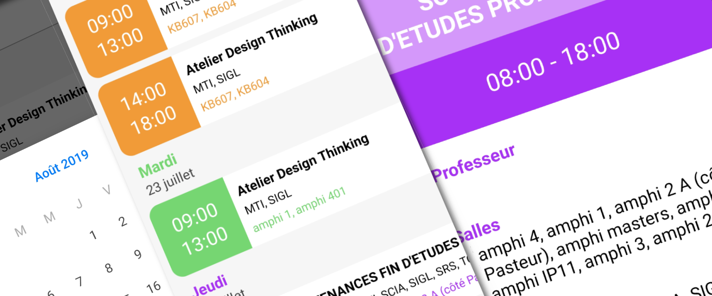


An Android app and its Backend to get information about EPITA classrooms availability.


## Project Genesis

At EPITA students can rely on *EpiLife*, a Mobile application (Android \& iOS) to check their timetables.

But timetables are not always full, so during inter-course we were frequently going to unused classrooms to work on school projects / prepare our exams.

**Problem:** To do so, the only solution was to manually check every classroom to find an available one. Often, 30 minutes after settling in, a teacher would arrived and take over the room 🥹.

From this came the idea of **EpiRoom**, a Mobile application allowing to see which classrooms are available and for how long (Based on all classes timetables).

## EpiRoom Python Backend

For this project, I developed a custom Python backend using Flask and PonyORM, based on a SQLite database.

Three reasons:
- The school API was mainly designed to deliver classes timetables. Getting information about rooms availability needed multiple requests.
- I didn’t have official access to the school API and didn’t want to risk causing an unintentional denial-of-service attack 😄.
- It was an excellent opportunity to learn stuff about backend development 🚀.

This Backend server is responsible of polling the school API every hour to get information about classes timetables, deduce rooms availability from it, store it in a SQLite database and serve all these information through a simple RESTful API.

## EpiRoom Android App

This app has been developed in Java with the help of some well known libraries:
- [Retrofit](https://github.com/square/retrofit): A type-safe HTTP client for Android and Java.
- [Butterknife](https://github.com/JakeWharton/butterknife): Field and method binding for Android views using annotations.
- [MPAndroidChart](https://github.com/PhilJay/MPAndroidChart): A powerful & easy to use chart library.
- ...

The app follows Material Design guidelines and was designed to address the user’s main need — quickly knowing which room to go to. To do so, the approach was to display these information in the form of a horizontal bar graph, with rooms ordered by availability time.

## Conclusion

EpiRoom was a small side project, but I learned a lot about building full-stack applications and handling real-time data. It also made inter-course time a lot less stressful — no more wandering from room to room! 😄
