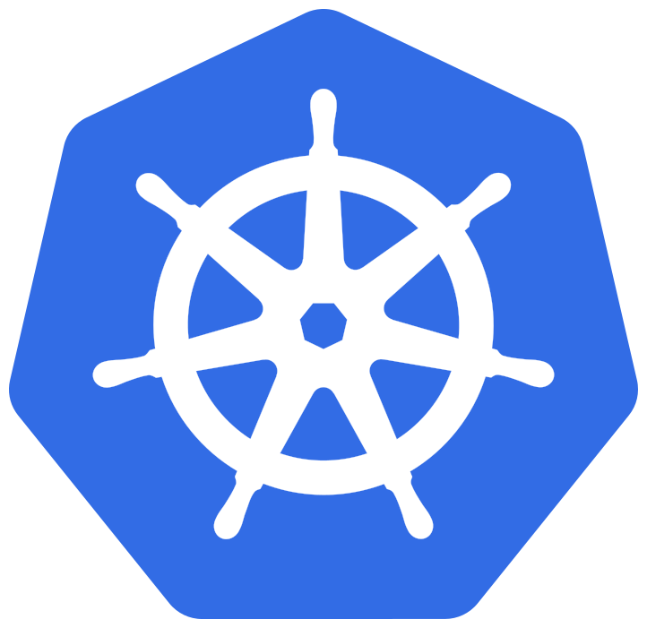
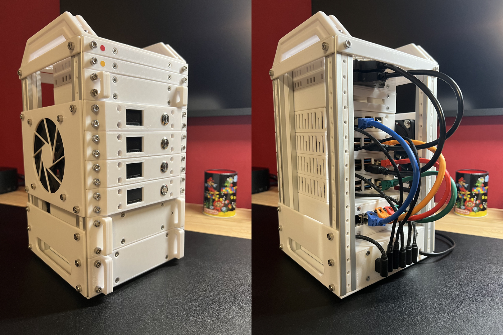
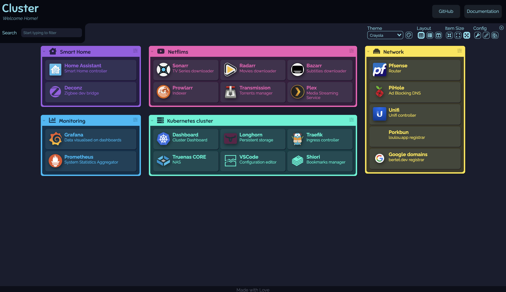
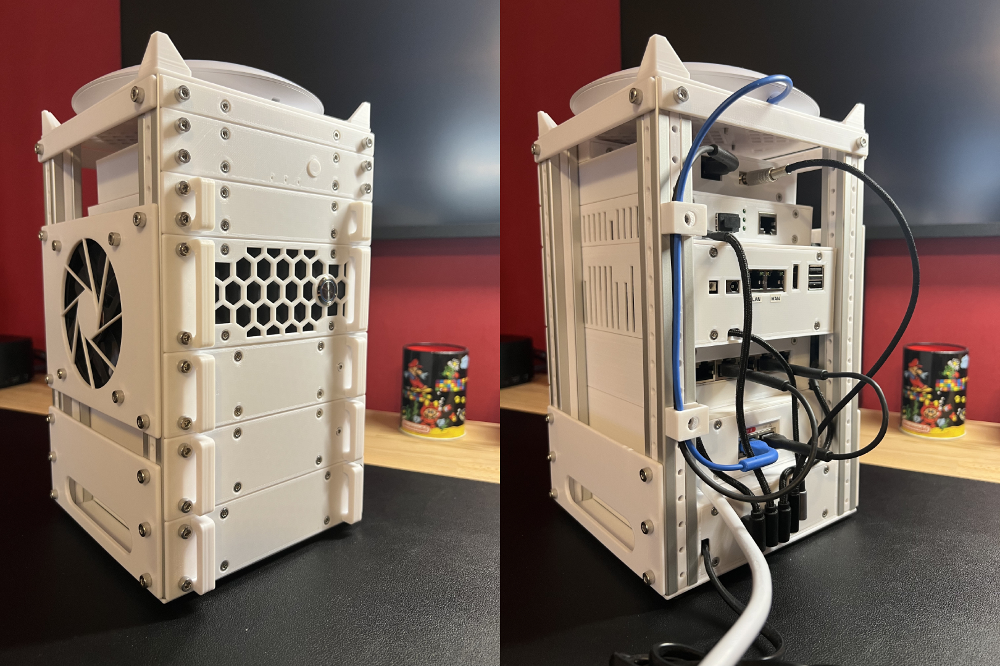
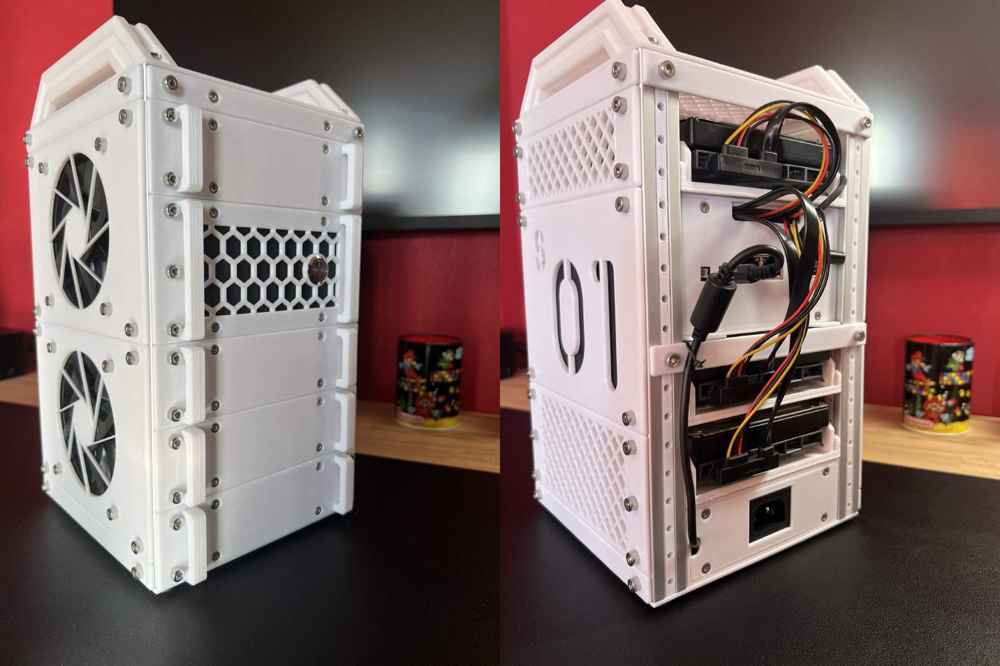
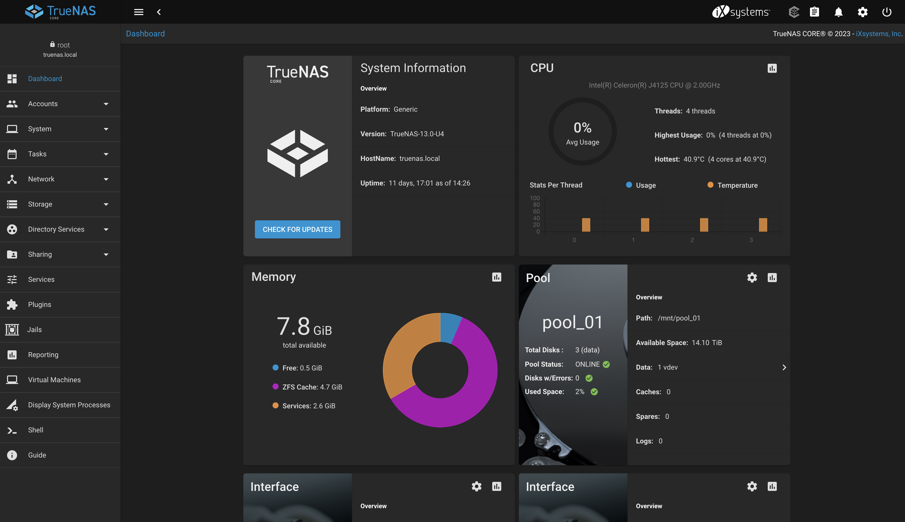


A self-hosted "mini datacenter" made of 3D-printed racks running Kubernetes, pfSense and TrueNAS.


## Project Genesis

At the beginning, my Homelab was composed of a single Raspberry Pi 3.

Its purpose was mainly to run *Home Assistant*, *Deconz* and *Pi-hole* Docker containers as part of [DOMO](/projects/domo) project. One day, my Home automation stopped working. After a quick investigation I understood that the Raspberry Pi microSD card had sadly died.

It would have been easy to rebuild it, since everything was already Dockerized and stored in Git. But I had just completed a [Kubernetes training course with Enix](https://enix.io/fr/formation-kubernetes/) and this failure highlighted the weaknesses of my setup: no redundancy, no monitoring, no backups.
So instead of rebuilding the same thing, I decided to design something closer to production infrastructure based on **Kubernetes** (Who said overkill? :smile:).

Almost two years later, here we are:

This project allowed me to **combine multiple hobbies**: 3D Modeling & Printing, System administration, Home automation and some basic electronics.

The entire homelab is built from 3D-printed mini-racks. Each rack is modular (1.5 cm per unit), allowing components to be replaced individually, just like in a real datacenter..
This "mini data center" is composed of **3 types of rack**:
* 2x **Compute** racks - *C01* and *C02*
* 1x **Network** rack - *N01*
* 1x **Storage** rack - *S01*

## Compute mini racks - C01 and C02

These racks host the Kubernetes cluster.

### Hardware

From top to bottom, C01 and C02 racks are composed of:
* 2x [Crucial BX500 SSDs](https://eu.crucial.com/ssd/bx500/ct500bx500ssd1) (240GB),
* 1x Empty 2U placeholder,
* 1x [Raspberry Pi 3](https://www.raspberrypi.com/products/raspberry-pi-3-model-b/) (1GB RAM),
* 3x [Raspberry Pi 4](https://www.raspberrypi.com/products/raspberry-pi-4-model-b/) (4GB RAM),
* 1x [TPLink TL-SG105 switch](https://www.tp-link.com/en/home-networking/soho-switch/tl-sg105/) (5 ethernet ports, GIGABIT),
* 1x [Anker PowerPort charger](https://www.amazon.fr/Anker-A2123L12-Chargeur-Secteur-PowerPort/dp/B00PTLSH9G) (6 USB ports, 60W)

A [Noctua NF-A9x14 fan](https://www.noctua.at/en/products/nf-a9x14-hs-pwm-chromax-black-swap#hero) is also mounted on the left side for cooling.

As you may see, each Raspberry Pi enclosure also includes a colored power button and a [1" OLED screen](https://fr.aliexpress.com/item/32638662748.html) on the front to display information about CPU usage, RAM usage, etc. This makes each node physically observable and individually controllable — very useful for maintenance and debugging.

#### Why Raspberry Pis?

One may ask why Raspberry Pis instead of "real" servers, there were several reasons:
- I already had some Raspberry Pis and they were cheap (before COVID-19),
- Their power consumption is low,
- It's more fun to run an orchestrator on multiple nodes to see the load distributed across them.
- Having 8 nodes to manage forced me to automate the configuration, doing everything manually would have taken too long 😄


**EDIT (2025-02-01):** These Raspberry Pis have since been replaced by 3x N100 mini computers allowing numerous improvements. See my [article about this](/projects/homelab_refactoring) for more information.


### Software

On the software side, these 8 Raspberry Pis form a Kubernetes cluster. In terms of Kubernetes distribution, I chose [K3S](https://k3s.io/), a lightweight distribution that is built for Edge computing and optimized for ARM.

The Raspberry Pis are configured using multiple tools:
* [Packer](https://www.packer.io/): To build reproducible ready-to-use Raspberry Pi OS image that includes SaltStack,
* [SaltStack](https://saltproject.io/) (Ansible equivalent): To configure users, setup the screen, install K3S, deploy Kubernetes system resources like ArgoCD, etc,
* [ArgoCD](https://argo-cd.readthedocs.io/en/stable/): To automatically deploy and manage applications on Kubernetes via GitOps.

The related configuration files are stored in dedicated Git repositories following GitOps methodology. The result: I can fully rebuild the cluster from scratch just by flashing images, applying SaltStack and letting ArgoCD deploy the Kubernetes workload.

This setup is designed like a **small production cluster** with:
* 3 control-plane nodes (high availability for etcd and API server),
* Load Balancing between nodes using [MetalLB](https://metallb.universe.tf/)
* Distributed & persistent storage on SSDs with [Longhorn](https://longhorn.io/) (iSCSI-based block storage),
* Monitoring, logging and alerting using Prometheus and Grafana,
* Nightly backups of the Longhorn volumes exported to the Storage mini rack,
* Servers plugged on a UPS (Uninterruptible Power Supply) monitored via [NUT](https://networkupstools.org/) (Network UPS Tools)

On the application side, these mini racks are used to run Home Assistant and Deconz of course but also *arr suite (Bazarr, Sonarr, Radarr, Prowlarr), Plex, Pihole, Gitlab, ... locally served but still accessible from outside through WireGuard VPN thanks to the Network mini rack.

## Network mini rack - N01

### Hardware

From top to bottom, N01 mini-rack is composed of:
* A [WiFi 6 Lite Unifi Access point](https://eu.store.ui.com/eu/en/collections/unifi-wifi-flagship-compact),
* An Empty 1U placeholder,
* A [Philips Hue Bridge](https://www.philips-hue.com/en-us/p/hue-bridge/046677458478),
* A GPON fiber to Copper Ethernet converter [TPLink MC220L](https://www.tp-link.com/fr/business-networking/accessory/mc220l/) (GIGABIT),
* A Mini PC [Odyssey X86J4125864](https://www.seeedstudio.com/ODYSSEY-X86J4125864-p-4916.html) (8GB RAM, Celeron J4125 CPU),
* A [Unifi switch mini](https://eu.store.ui.com/eu/en/collections/unifi-switching-utility-mini/products/usw-flex-mini) (5 ethernet ports, GIGABIT),
* A [Unifi POE Adapter](https://eu.store.ui.com/eu/en/collections/unifi-accessory-tech-poe-and-power/products/u-poe-af) (Needed for the Access point),
* A [Anker USB-C PowerPort charger](https://www.amazon.fr/gp/product/B072K4TB67) (4 USB-A ports, 1 USB-C Port, 60W)

#### Why Odyssey X86J4125864?

First things first, I wanted to use pfSense which is not ARM compatible so Raspberry Pi wasn't an option so I needed an x86 architecture PC but wanted to keep:
- **Low power consumption**,
- A **limited footprint** to fit it in a 5" mini rack,
- **GPIO pins** to control devices like external displays or sensors via I2C, SPI, etc.

The Odyssey X86J4125864 mini PC was the logical choice since it was one of the only ones that met all these requirements.

### Software

The *Odyssey X86J4125864* acts as a router running **pfSense CE** (Community Edition).

This setup allowed me to:
* Replace the ISP router using the TPLink Fiber to ethernet converter,
* Access my local network remotely using WireGuard secure VPN tunnel,
* Set up Dynamic DNS service that dynamically updates the public IP mapped to the hostname I use for VPN,
* Create multiple VLAN (Virtual LAN): One for IoT devices with rules that prevent potential security breaches from affecting the main network, one for guests, ...
* Set up DHCP Static mappings,
* ...

But mostly to learn Network-related concepts!

To sum it all up, here is a simple **Network topology diagram**:

graph TD
    A[ISP Fiber] --> B[MC220L Media Converter]
    B --> C[pfSense Router]
    C --> D[UniFi Switch]
    D --> E[Philips Hue Bridge]
    D --> H[UniFi WiFi AP]
    H --> I[Main VLAN]
    H --> J[IoT VLAN]
    H --> K[Guest VLAN]
    D --> F[Compute Racks]
    D --> G[Storage Rack]


## Storage mini rack - S01

### Hardware

From top to bottom, S01 mini-rack is composed of:
* 1x Empty 1U placeholder,
* 1x 8TB Western Digital Hard drive,
* 1x Mini PC [Odyssey X86J4125864](https://www.seeedstudio.com/ODYSSEY-X86J4125864-p-4916.html) (8GB RAM, Celeron J4125 CPU),
* 2x 8TB Western Digital Hard drives,
* 1x Power brick (12V, 9A)

### Software

This rack acts as a NAS running **TrueNAS CORE** with **14TB usable capacity** (RAIDZ1).

It is used to store data but also to store Kubernetes volumes backups. In fact, Longhorn replicates volumes across the SSDs in the compute nodes, but those volumes are also backed up nightly to TrueNAS. This gives both **high availability** and **disaster recovery**.

### Conclusion

This homelab started as a small personal project and gradually grew into a modular, multi-node setup. It allowed me to **learn new DevOps practices** and **experiment** with the same tools and principles I use in professional environments: GitOps, Kubernetes, network segmentation, monitoring, backups, reproducibility. etc.


**EDIT (2026-01-01):** During my one-year break, this project became my main playground to experiment, learn and break things. I used that time to refactor it and make multiple improvements, see my [Homelab refactoring article](/projects/homelab_refactoring).

