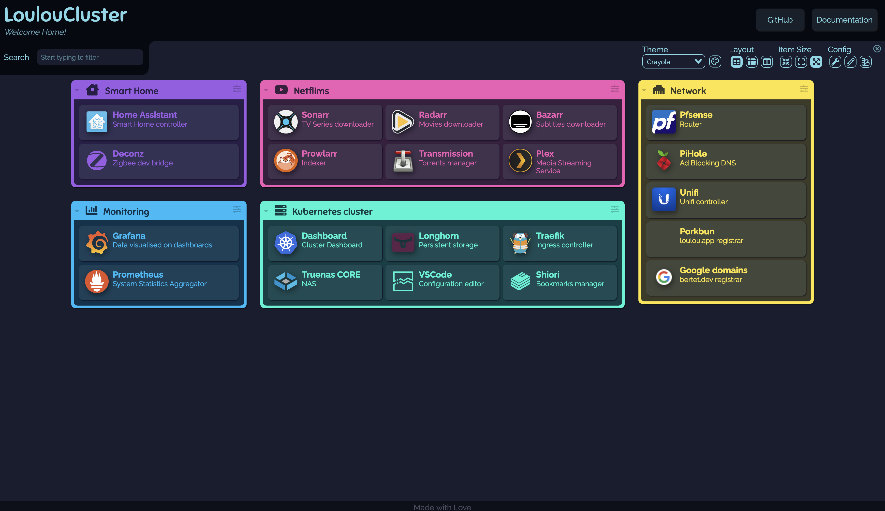
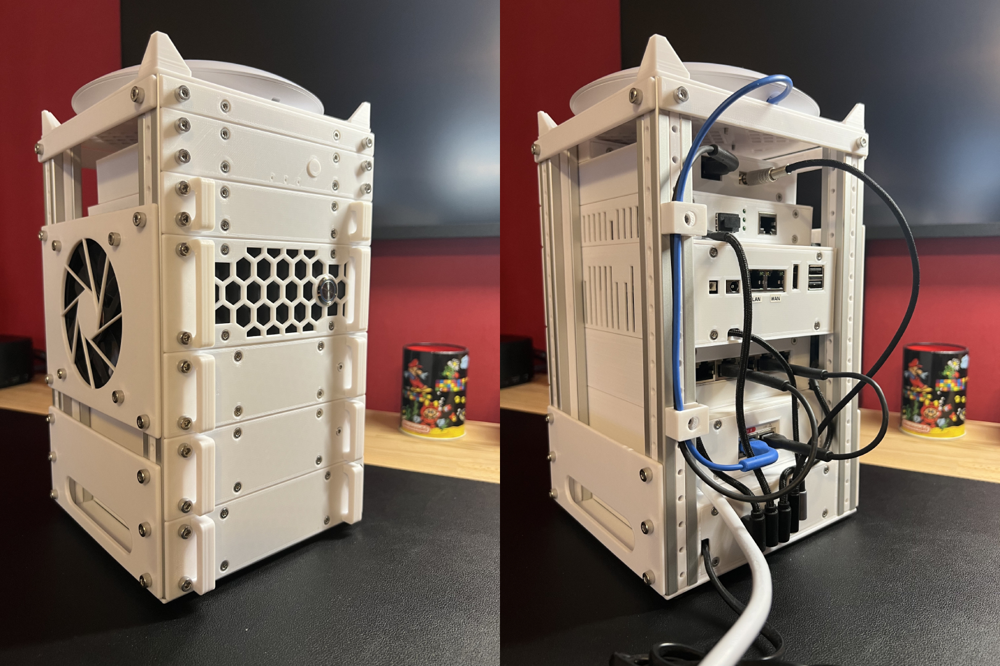


A Homelab made of 4 3D-Printed Mini racks running Kubernetes, TrueNas and pfSense.


## Project Genesis

At the beginning, my Homelab was composed of a single Raspberry Pi 3.

Its purpose was mainly to run *Home Assistant*, *Deconz* and *Pi-hole* docker containers as part of [DOMO](/projects/domo) project. One day, my Home automation stopped working. After a quick investigation I understood that the Raspberry Pi micro-SD card had sadly died.

It would have been easy to replicate it since everything was dockerized / on github but this misadventure was the perfect excuse to build an almost prod-ready infrastructure based on Kubernetes (who said overkill?).

Almost two years later here where are :smile: :

This project allowed me to mix several hobbies of mine:
* 3D Modeling & Printing
* System administration
* Home automation
* Some basic electronic

The Mini racks are structures divided into units (1.5cm high) capable of accommodating rack mounted stuff, exactly like datacenter conventional racks.
They are made this way so it's easy to individually replace parts in the event of failure.

This "mini data center" is composed of 3 types of rack: Compute / Network / Storage.

## Compute mini racks - C01 and C02

### Hardware side

From top to bottom, each of them is composed of:
* 2 [Crucial BX500 SSDs](https://www.amazon.fr/Crucial-CT240BX500SSD1-Interne-BX500-Pouces/dp/B07G3YNLJB) (240GB),
* 1 Empty 2U placeholder,
* 1 [Raspberry Pi 3](https://www.kubii.fr/cartes-raspberry-pi/2119-raspberry-pi-3-modele-b-1-gb-kubii-652508442174.html) (1GB RAM),
* 3 [Raspberry Pi 4](https://www.kubii.fr/cartes-raspberry-pi/2772-nouveau-raspberry-pi-4-modele-b-4gb-kubii-3272496309333.html) (4GB RAM),
* A [TPLink TL-SG105 switch](https://www.amazon.fr/TP-Link-TL-SG105-Switch-Gigabit-Bo%C3%AEtier/dp/B00A128S24) (5 ethernet ports, GIGABIT),
* An [Anker PowerPort charger](https://www.amazon.fr/Anker-A2123L12-Chargeur-Secteur-PowerPort/dp/B00PTLSH9G) (6 USB ports, 60W)

Without forgetting a [Noctua NF-A9x14 fan](https://www.amazon.fr/Noctua-NF-A9x14-HS-PWM-chromax-black-swap-Ventilateur/dp/B07ZHG7V34) on the left side.

As you may see, each Raspberry Pi enclosure also includes a colored power button and a [1" OLED screen](https://fr.aliexpress.com/item/32638662748.html) on the front to display information about CPU usage, RAM usage, etc.


**EDIT (2025-02-01):** These Raspberry Pi have since been replaced by 3x N100 mini computers allowing numerous improvements. See my [article about this](/projects/homelab_refactoring) for more information.


### Software side

On the software side, these 8 Raspberry Pi form a Kubernetes (K3S) cluster.

Their configuration is done using multiple tools:
* [Packer](https://www.packer.io/): To build a ready-to-use Raspberry Pi OS image that includes SaltStack,
* [SaltStack](https://saltproject.io/) (Ansible equivalent): To configure users, setup the screen, install K3S, deploy Kubernetes system resources like ArgoCD etc,
* [ArgoCD](https://argo-cd.readthedocs.io/en/stable/): To automatically deploy applications on Kubernetes based on Git repositories.

All of that is stored in Git repositories following GitOps methodology.

This setup is almost production ready with:
* 3 "master nodes",
* Load Balancing between nodes using [MetalLB](https://metallb.universe.tf/)
* Distributed and redundant persistent storage based on [Longhorn](https://longhorn.io/),
* Monitoring, logging and alerting using Prometheus and Grafana,
* Backups perfomed in the Storage mini rack every night,
* Servers plugged on a UPS monitored with [nut](https://networkupstools.org/)

On the application side, these mini racks are used to run Home Assistant and Deconz of course but also *arr suite (Bazarr, Sonarr, Radarr, Prowlarr), Plex, Pihole, Gitlab, ... locally served but still accessible from outside through Wireguard VPN.

## Network mini rack - N01

### Hardware side

From top to bottom, N01 mini-rack is composed of:
* A [WiFi 6 Lite Unifi Access point](https://eu.store.ui.com/eu/en/collections/unifi-wifi-flagship-compact),
* An Empty 1U placeholder,
* A [Philips Hue Bridge](https://www.philips-hue.com/fr-fr/p/hue-hue-bridge/8719514342620),
* A [Fiber to ethernet converter TPLink MC220L](https://www.tp-link.com/fr/business-networking/accessory/mc220l/) (GIGABIT),
* A Mini PC [Odyssey X86J4125864](https://www.seeedstudio.com/ODYSSEY-X86J4125864-p-4916.html) (8GB RAM, Celeron J4125 CPU),
* A [Unifi switch mini](https://eu.store.ui.com/eu/en/collections/unifi-switching-utility-mini/products/usw-flex-mini) (5 ethernet ports, GIGABIT),
* A [Unifi POE Adapter](https://eu.store.ui.com/eu/en/collections/unifi-accessory-tech-poe-and-power/products/u-poe-af) (Needed for the Access point),
* A [Anker USB-C PowerPort charger](https://www.amazon.fr/gp/product/B072K4TB67) (4 USB-A ports, 1 USB-C Port, 60W)

### Software side

The Mini PC Odyssey X86J4125864 acts as a router running pfSense.

This setup allowed me to:
* Replace the need of the ISP router using the TPLink Fiber to ethernet converter,
* Access my local network remotely using Wireguard,
* Create multiple VLAN: One for IOT objects, one for guests, ...
* Setup DHCP Static mappings,
* ...

But mostly to learn Network related stuff!

## Storage mini rack - SO1

### Hardware side

From top to bottom, S01 mini-rack is composed of:
* 1 Empty 1U placeholder,
* 1 8TB Western Digital Hard drive,
* 1 Mini PC [Odyssey X86J4125864](https://www.seeedstudio.com/ODYSSEY-X86J4125864-p-4916.html) (8GB RAM, Celeron J4125 CPU),
* 2 8TB Western Digital Hard drives,
* 1 Power brick (12V, 9A)

### Software side

This rack acts as a 14TB NAS using TrueNas CORE.

It is used to store data but also to store Kubernetes volumes backups.
