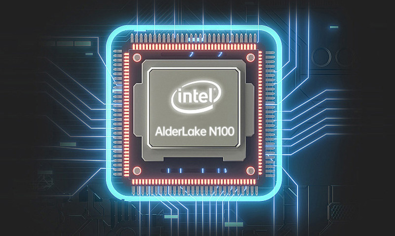
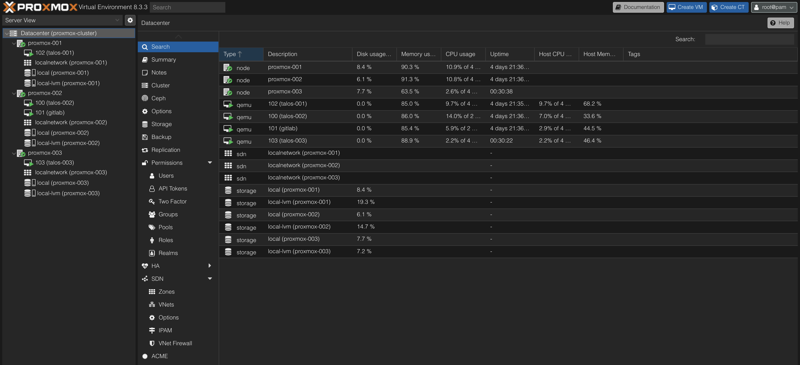
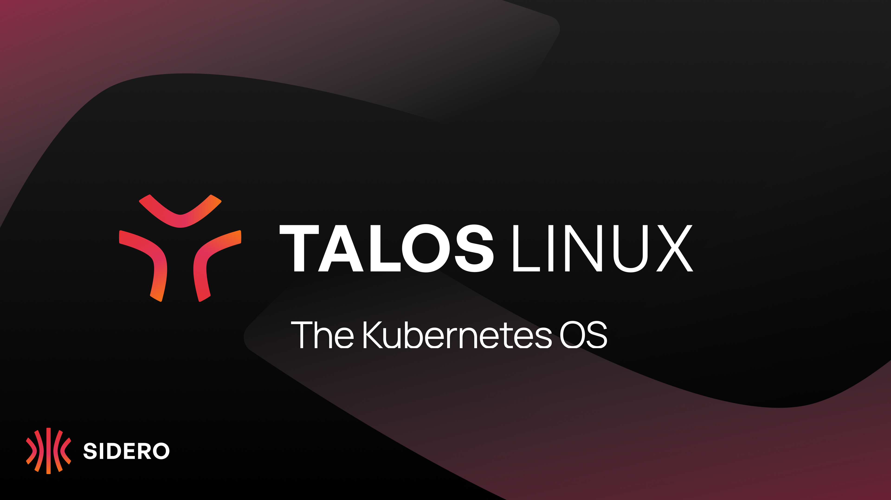
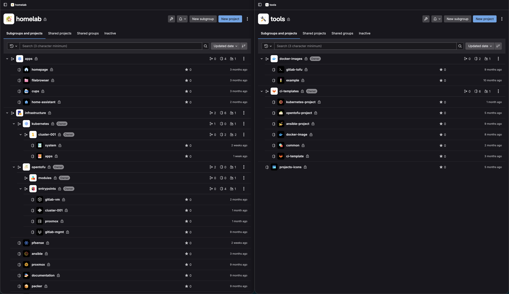
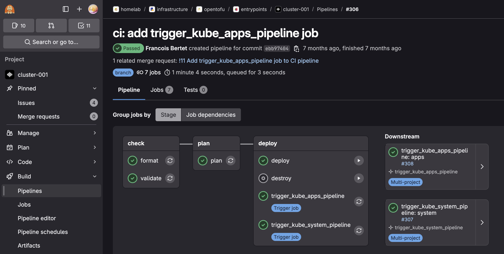


Homelab refactoring using N100 mini computers, Proxmox, Talos Linux, OpenTofu, Ansible, etc with a GitOps strategy at its heart.



This project is still a Work in progress.


## Project Genesis

After running my homelab for quite some time on Raspberry Pis (See [previous article](/projects/homelab)), the setup was stable and functional. However, as new needs emerged, the platform started to show some limitations.

This article focuses on the major improvements, both regarding the hardware and the software:
- Compute upgrade: Raspberry Pis → N100
- Bare Metal → Virtualization using Proxmox
- Kubernetes OS: Debian + K3S → Talos Linux
- GitOps at every level, including to deploy the infrastructure
- Deployment of new apps + improvements
- Critical components moved outside of the Kubernetes cluster

This refactoring also became the **main technical project** I worked on during my one‑year break (Sep 2024 - Dec 2025), giving me time to redesign the platform in depth. Also, to speed things up and explore new approaches, I started using LLMs (especially Claude by Anthropic) as an assistant for benchmarking and templating. It was very helpful, but it still requires a lot of vigilance and manual reviews, as it tends to hallucinate configuration options, especially for tools that are not widely used.

## Compute Upgrade: Pis → N100

The first major change I made was **replacing the Raspberry Pi cluster with three mini computers** powered by an [Intel N100 Processor](https://www.intel.fr/content/www/fr/fr/products/sku/231803/intel-processor-n100-6m-cache-up-to-3-40-ghz/specifications.html).

The Intel N100 is a recent low-power x86 CPU from Intel’s Alder Lake-N family offering:
- 4 x86 cores with significantly better performance compared to Raspberry Pi CPUs,
- Very low power consumption (6W when idle),
- Hardware virtualization support,
- Hardware acceleration for video encoding (useful for running Plex).

The icing on the cake is that N100 mini computers aren't even more expensive than Raspberry Pis when you include all the accessories (power supply, storage, cooling, case, etc.).

That additional compute power gave me the ability to run a hypervisor reliably and GitLab flawlessly.
I also benefited from the x86_64 architecture since many Docker images are still not available or poorly supported on ARM.

## Virtualization Layer: Proxmox

### Why Virtualization?

I wanted to push GitOps even further, being able to destroy/rebuild the whole infrastructure in one click via a CI/CD pipeline. This is made possible thanks to virtualization and *Infrastructure as Code* using [OpenTofu](https://opentofu.org/) (community-owned fork of Terraform), similar to what is used in professional environments.

Why? To ensure reproducibility. In fact, Ansible is a powerful configuration management tool, but because it doesn’t enforce immutability, configuration drift and leftover artifacts can happen over time. The safest way to validate reproducibility is to reapply the configuration on a fresh machine. This is hard to do without manual steps on bare metal but much more feasible with virtualization.

Of course, this virtualization layer adds some CPU and RAM overhead but I considered it acceptable on the new PCs + it was a good excuse to learn to use Proxmox VE 😄.

### Why Proxmox VE?

[Proxmox Virtual Environment](https://www.proxmox.com/en/) is a complete, open-source Type 1 hypervisor.

Compared to its competitors (VMWare, Hyper-V, etc.), Proxmox VE is interesting for homelabing since it gives enterprise-grade virtualization (VMs, clustering, ZFS, backups, HA, ...) for free on normal hardware with no feature lockouts.

In the end, it effectively works as a private cloud, mimicking the behavior of AWS EC2 web GUI 🤗.

Proxmox VE cluster across the 3 N100 nodes currently runs 4 VMs:
- 1x `gitlab` virtual machine under *Debian* OS running *GitLab + GitLab runner* Docker containers configured using OpenTofu + Ansible.
- 3x `talos` virtual machines running *Talos Linux* OS (one per Proxmox node) that runs Kubernetes, configured using OpenTofu + Argo-CD (More information below).

## Kubernetes OS: From Debian + K3S to Talos Linux

To further limit manual steps and configuration drift, I switched from Debian to [Talos Linux](https://www.talos.dev/) operating system.

Talos Linux is a minimal, immutable, and Kubernetes-focused operating system.
No SSH access, no shell, no package manager: everything is managed through an API and declarative YAML files. It is designed specifically to run Kubernetes securely and predictably, which forces an infrastructure-as-code mindset, where every configuration change is versioned and reproducible.

On the network side, my Kubernetes cluster now uses [Cilium](https://cilium.io/) instead of Flannel as its CNI, chosen for eBPF‑based networking and security. It also replaced MetalLB with the Cilium L2 Announcements part.

As mentioned above, all of that is configured using OpenTofu and automatically deployed when changes are pushed to GitLab via a CI/CD following GitOps principles.

## GitOps Everywhere

One of the main goals of this upgrade was to push GitOps even further — not only for configuration & applications, but for the whole infrastructure.

Almost everything is managed via configuration files and Infrastructure as Code deployed through CI/CD. The code is stored in a multitude of GitLab repositories:

At first, my goal was to instantiate the VMs, set up the Kubernetes cluster and deploy every Kubernetes system component (networking, storage, ...) using OpenTofu. Then ArgoCD would have been used for the Kubernetes apps deployment only.

**Problem:** It is a [known issue](https://github.com/hashicorp/terraform-provider-kubernetes/issues/1782) that the Kubernetes OpenTofu provider does not correctly handle dependencies when using the `kubernetes_manifest` resource. As a result, despite explicit `depends_on` statements on the Proxmox and Talos resources (which are responsible for creating the Kubernetes cluster), `tofu plan` failed because it attempted to deploy Kubernetes resources before the cluster was created 😅.

This is why I finally dropped this idea and decided to keep OpenTofu for the infrastructure part but to deploy every Kubernetes resource (both system components and apps) using ArgoCD. But how? In fact, ArgoCD itself needs system components which leads to a "chicken and egg" problem 🥚🐔.

In the end, the whole infrastructure deployment is made in **five steps**:
1. Virtual Machines are provisioned and Talos Linux is configured using OpenTofu
2. A minimal ArgoCD instance is deployed by a simple shell script
3. This minimal ArgoCD instance deploys core system components: traefik, external-dns, nfs-external-provisioner, prometheus stack, sealed-secrets, ...
4. The minimal ArgoCD deploys the full ArgoCD, with dashboards and external access
5. Finally, the applications are deployed by ArgoCD.

All of it is embedded in a GitLab CI/CD cross-project pipeline:

As you may have seen, a manual job also allows me to destroy everything, making reproducibility tests easy to perform.

## Changes on the Apps side: Helm, KitchenOwl, CUPS, etc.

Some changes were also made on the apps side:
* I migrated most of my Kubernetes generic manifests to factorized Helm Charts using [bjw-s app template helm chart](https://github.com/bjw-s-labs/helm-charts). In fact, most of them were very similar: Basic deployment, Secret, ConfigMap, Volume, Service and Ingress resources.
* The N100 CPUs allowed me to improve Plex performance thanks to hardware acceleration.
* I deployed a lot of new apps: some that I never ended up using and eventually removed, and others that I use every day and highly recommend. More below ⬇️.

### KitchenOwl

[KitchenOwl](https://github.com/TomBursch/kitchenowl) is a smart self-hosted grocery list and recipe manager.

It provides:
* Native desktop (web) and mobile apps on both iOS and Android
* Store recipes and add them to a shopping list synced in real time with multiple users
* Create meal plans
* etc.

Thanks to KitchenOwl, we now generate weekly shopping lists from meal plans in seconds, synced across phones. This simple app, running on the Kubernetes cluster, has turned grocery shopping from a painful chore into a much faster and more organized task.

While not directly exposed to the internet, it is still accessible from anywhere (typically from the supermarket 😄) via the WireGuard VPN configured on pfSense (See more about the Network rack [here](/projects/homelab/#network-mini-rack---n01)).

**Protip:** For not having to enable/disable the VPN manually on our iPhones, we set up a [shortcut](https://support.apple.com/guide/shortcuts/welcome/ios) that does it automatically based on the Wi-Fi network SSID we are connected to.

### CUPS

*CUPS (Common UNIX Printing System) is the standard printing system used on most Unix-like OSes.
A computer running CUPS is a host that can accept print jobs from client computers, process them and send them to a printer.*

I have an old *Ricoh SP211SU* printer that still works fine but doesn't have Wi-Fi, which was quite annoying to use. Instead of buying a new one, I plugged it into one of the N100 nodes via USB.

By running CUPS, I’ve basically been able to turn this 'dumb' printer into a network one. Since the printer is physically connected to one specific node, I labeled that node and told Kubernetes to only schedule the CUPS deployment there using a *nodeSelector*.

It’s a small win, but it kept old hardware out of the trash :-).

## Critical components outside of Kubernetes cluster

Last important change: most critical parts of the infrastructure like GitLab, PiHole DHCP/DNS server or Unifi controller have been moved outside of Kubernetes.

These tools are running inside Docker containers on Debian OS and nightly backups of their volumes are made using [autorestic](https://autorestic.vercel.app/), stored on TrueNAS.

Historically, I was used to SaltStack, but this time, the configuration is made using [Ansible](https://docs.ansible.com/). The reason is that Ansible has a larger community and a better collection support for most of the tools, so I wanted to start learning it.

Removing the dependency between these critical components and Kubernetes fixed another “chicken and egg” problem since they were required to rebuild the Kubernetes cluster 😅.

To go further, I am working on adding a dedicated test environment, as a separate lightweight cluster with its own ArgoCD applications, in order to validate changes before rolling them out to the main cluster.

## Conclusion

This refactoring turned my homelab from a fun Raspberry Pi cluster into a small, reproducible “mini cloud” much closer to what is run in production: virtualization with Proxmox, an immutable Kubernetes OS with Talos, GitOps and IaC across every layer, and critical services decoupled from the cluster.

The project is still evolving, but the new foundation already makes it much easier to experiment, break things safely, and rebuild everything from scratch — which is exactly what a homelab is made for.
